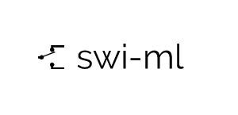

<br />
<p align="center">
  <a href="https://github.com/aitikgupta/swi-ml">
    
  </a>
  <p align="center">
    A machine learning library written from scratch - with runtime switchable backend!
  </p>
</p>

This library builds on a personal project, provides a single interface to interact with single-core CPU operations (with `NumPy` backend), as well as hundreds of cores on a GPU (with `CuPy` backend), in runtime!

NOTE: This is NOT an alternative to libraries like `scikit-learn` and `cuML`. Their interfaces are complete on their own!

[![Forks][forks-shield]][forks-url]
[![Stargazers][stars-shield]][stars-url]
[![MIT License][license-shield]][license-url]
[![LinkedIn][linkedin-shield]][linkedin-url]

### Prerequsites

`swi-ml` is built on bare Python and NumPy backbones, all other dependencies are optional!
* [NumPy](https://numpy.org/)
* [CuPy](https://cupy.dev/) (optional)
* [Matplotlib](https://matplotlib.org) (optional)

### Installation

1. (Optional) Setup a virtual environment using `virtualenv` or `anaconda`.
2. Install [NumPy](https://numpy.org/) by following their [insallation guide](https://numpy.org/install/) or simply via `pip`:
    ```console
    pip install numpy
    ```
3. (Optional) For GPU-supported backend, setup a working installation of [CuPy]() by following their [installation guide](https://docs.cupy.dev/en/stable/install.html#install-cupy).
    ```console
    python -c 'import cupy; cupy.show_config()'
    ```
4. (Optional) Install [Matplotlib](https://matplotlib.org) to plot specific curves. (via their [installation guide](https://matplotlib.org/users/installing.html))
5. Install `swi-ml`:
   ```console
   pip install swi-ml  # from PyPI
   pip install git+https://github.com/aitikgupta/swi-ml  # from Github
   ```
6. (Optional) To run the pre-defined tests, install [pytest](https://docs.pytest.org/en/stable/) by following their [installation guide](https://docs.pytest.org/en/stable/getting-started.html) or simply via `pip`:
   ```console
   pip install pytest
   ```

## Usage

### Switching backend
```python
from swi_ml import set_backend

# numpy backend (CPU)
set_backend("numpy")

# cupy backend (GPU)
set_backend("cupy")
```

### A simple Linear Regression with Gradient Descent
```python
from swi_ml.regression import LinearRegressionGD

data = [[1], [2], [3]]
labels = [2, 4, 6]

model = LinearRegressionGD(
    num_iterations=3,
    learning_rate=0.1,
    normalize=False,
    initialiser="uniform",
    verbose="DEBUG",
)

model.fit(data, labels)

print("Current MSE:", model.curr_loss)
```

#### Output:
```console
INFO: Backend is not set, using default `numpy`
INFO: Setting backend: numpy
INFO: MSE (1/3): 13.93602
INFO: MSE (2/3): 0.22120
INFO: MSE (3/3): 0.05478
INFO: Training time: 0.00035 seconds
Current MSE: 0.054780625247184585
```

_For more concrete examples, please refer to [examples directory](https://github.com/aitikgupta/swi-ml)._

### Running the tests

To run the testing suite, execute the following command in the root directory:
```console
python -mpytest  # run the whole suite
python -mpytest tests/test_module.py  # run the specific test module
```

## Contributing

Contributions are what makes the open source community such an amazing place to learn, inspire, and create. Any contributions are _much appreciated!_

1. Fork the Project
2. Create your Feature Branch (`git checkout -b feature/AmazingFeature`)
3. Commit your Changes (`git commit -m 'Add some AmazingFeature'`)
4. Push to the Branch (`git push origin feature/AmazingFeature`)
5. Open a Pull Request

## License

Distributed under the MIT License. See `LICENSE` for more information.


## Acknowledgements

* Logo created at [LogoMakr.com](https://logomakr.com/9smwTn)
* [Img Shields](https://shields.io)
* [Choose an Open Source License](https://choosealicense.com)

## About

Aitik Gupta - [Personal Website](aitikgupta.github.io)

Project Link: [https://github.com/aitikgupta/swi-ml](https://github.com/aitikgupta/swi-ml)

[contributors-shield]: https://img.shields.io/github/contributors/aitikgupta/swi-ml.svg?style=flat-square
[contributors-url]: https://github.com/aitikgupta/swi-ml/graphs/contributors
[forks-shield]: https://img.shields.io/github/forks/aitikgupta/swi-ml.svg?style=flat-square
[forks-url]: https://github.com/aitikgupta/swi-ml/network/members
[stars-shield]: https://img.shields.io/github/stars/aitikgupta/swi-ml.svg?style=flat-square
[stars-url]: https://github.com/aitikgupta/swi-ml/stargazers
[issues-shield]: https://img.shields.io/github/issues/aitikgupta/swi-ml.svg?style=flat-square
[issues-url]: https://github.com/aitikgupta/swi-ml/issues
[license-shield]: https://img.shields.io/github/license/aitikgupta/swi-ml.svg?style=flat-square
[license-url]: https://github.com/aitikgupta/swi-ml/blob/master/LICENSE
[linkedin-shield]: https://img.shields.io/badge/-LinkedIn-black.svg?style=flat-square&logo=linkedin&colorB=555
[linkedin-url]: https://linkedin.com/in/aitik-gupta
[product-screenshot]: images/screenshot.png